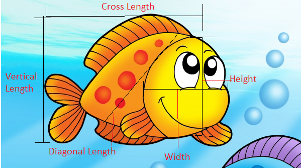

```{r packages, echo = FALSE, message=FALSE, warning=FALSE}
library(tidyverse)
library(DataExplorer)
library(janitor)
library(dplyr)
library(shiny)
library(tidymodels)
library(ggtext)
library(knitr)
library(kableExtra)
set.seed(1234)
options(dplyr.print_min = 10, dplyr.print_max = 6)

```


## The dataset

The used data set in this project composed of a record of 7 common different fish species in fish market sales. For each fish participated on this record, a certain measurements were taken, which are the fish species, the weight in Gram g, vertical length in cm, diagonal length in cm, cross length in cm, height in cm and diagonal width in cm.

```{r out.width="98%", echo=FALSE}

```

The data was obtained from  **Kaggle ** website, to access the source of the data use the link below

[Link to the dataset ](https://www.kaggle.com/aungpyaeap/fish-market){target="_blank"}


```{r,echo = FALSE, message=FALSE, warning=FALSE}
# Read the data  and perform data Transformation:

dataset <- read_csv("Fish.csv") %>% 
  clean_names()%>%
  rename(vertical_length = length1, diagonal_length = length2, cross_length = length3)%>%
  select(species,weight,vertical_length,diagonal_length,cross_length,height,width)


```


## Explanatory data analysis

 In this part we are going to create a data profiling report, in this report we can get an overview of the shape and structure of our dataset by summarizing their main characters and use  statistical graphics and other data visualization methods.

```{r,echo = FALSE, message=FALSE, warning=FALSE}
 #create_report(dataset)
```

<iframe height="800" width="100%" frameborder="no"src="./report.html/"> </iframe>

Based on the data profiling report, specifically in the Univariate Distribution Histogram part , We can see that there are some fishes in our data set with zero weights, we need to remove the rows where the weight equal to zero.

```{r,echo = FALSE, message=FALSE, warning=FALSE}

# Removing any fish with 0 gram weight

dataset<-dataset[apply(dataset!=0, 1, all),]

```


To access the **Data Profiling Report** in a new window please press the link below
 [Link to open the data profiling report in a new window ](./report.html){target="_blank"}


In this part we can interactively perform further exploration to our data set.


<iframe height="1000" width="100%" frameborder="no"src="https://nouran.shinyapps.io/2021-06-21-project/"> </iframe>


To open the **Shiny app** in a new window please press the link below
[Link to open the Shiny app in a new window](https://nouran.shinyapps.io/2021-06-21-project/){target="_blank"}


# Fitting a model to predict the fish height based on it's cross length


### Linear Regression Model

- To create a liner regression model to predict the height of a fish given its cross length, we need to determine the value of  $\beta_0$ that is the population parameter for the intercept and the value of $\beta_1$ that is the population parameter for the slope as shown in the following model:


 $$\widehat{Height}_{i} = \beta_0 + \beta_1 \times Cross Length_{i}$$ 


```{r fit-model,echo = FALSE, message=FALSE, warning=FALSE,results=FALSE}
linear_reg() %>%
  set_engine("lm") %>%
  fit(height~cross_length, data = dataset)
```

---

Using liner regression model enables us to determine the values of both $\beta_0$  and $\beta_1$, updating the model with the values we get the following updated model:  


 $$\widehat{Height}_{i} = 0.87 + 0.26 \times Cross Length_{i}$$ 


---

```{r height-cross_length-plot, echo=FALSE, warning=FALSE,message=FALSE,out.width="100%"}
ggplot(data = dataset, aes(x = cross_length,y = height )) +
  geom_point() +
  labs(
    title = "Height vs.Cross Length",
    subtitle = "The data",
    y= "Height (cm)",
    x = "Cross Length (cm)"
  )+
 theme(plot.caption  = element_text(hjust = 0.5),plot.title = element_text(hjust = 0.5))+
theme_bw()+
  theme(axis.text.x=element_text(color = "red", size=9, vjust=.5, hjust=0.7)) +
  theme(plot.background = element_rect(fill = "#BFD5E3"))+
  theme(plot.caption  = element_text(hjust = 0.5),plot.title = element_text(hjust = 0.5))+
    theme(plot.caption  = element_text(hjust = 0.5),plot.subtitle = element_text(hjust = 0.5))+
      theme(plot.subtitle = element_text(colour = "#E48957", face = "bold", size = rel(1.5)))


```


```{r heightcross_length-plot, echo=FALSE, warning=FALSE,message=FALSE,out.width="100%"}
ggplot(data = dataset, aes(x = cross_length,y = height )) +
  geom_point() +
  geom_smooth(method = "lm", se = FALSE, color = "#8E2C90") + 
  labs(title = "Height vs.Cross Length",subtitle = " The data + Least squares line ",y= "Height (cm)",x = "Cross Length (cm)")+
   theme_bw()+
   theme(axis.text.x=element_text(color = "red", size=9, vjust=.5, hjust=0.7)) +
   theme(plot.background = element_rect(fill = "#BFD5E3"))+
   theme(plot.caption  = element_text(hjust = 0.5),plot.title = element_text(hjust = 0.5))+
   theme(plot.caption  = element_text(hjust = 0.5),plot.subtitle = element_text(hjust = 0.5))+
   theme(plot.subtitle = element_text(colour = "#E48957", face = "bold", size = rel(1.5)))
```


```{r vis-res-1, echo=FALSE,warning=FALSE,message=FALSE,out.width="100%"}
ht_cl_fit <- linear_reg() %>%
  set_engine("lm") %>%
  fit(height ~ cross_length, data = dataset)

ht_cl_fit_tidy <- tidy(ht_cl_fit$fit) 

ht_cl_fit_aug  <- augment(ht_cl_fit$fit) %>%
  mutate(res_cat = ifelse(.resid > 0, TRUE, FALSE))

ggplot(data = ht_cl_fit_aug,aes( x = cross_length, y = height)) +
geom_point(alpha = 0.2) + 
labs(title = "Height vs.Cross Length",subtitle = "The data + Least squares line + Residuals",y= "Height (cm)",x = "Cross Length (cm)")+
geom_smooth(method = "lm", color = "#8E2C90", se = FALSE) +
geom_point(mapping = aes(y = .fitted), color = "#E48957") +
geom_segment(mapping = aes(xend = cross_length, yend = .fitted), color = "#E48957", alpha = 0.4) +
   theme_bw()+
   theme(axis.text.x=element_text(color = "red", size=9, vjust=.5, hjust=0.7)) +
   theme(plot.background = element_rect(fill = "#BFD5E3"))+
   theme(plot.caption  = element_text(hjust = 0.5),plot.title = element_text(hjust = 0.5))+
   theme(plot.caption  = element_text(hjust = 0.5),plot.subtitle = element_text(hjust = 0.5))+
   theme(plot.subtitle = element_text(colour = "#E48957", face = "bold", size = rel(1.5)))
```


